# Credit Card transaction Fraud Detection
In this project will be going through a sample Fraud detection project.
Below are the major steps in this project
1. Downloading data 
2. Basic Statistic EDA
3. Dimensional reduction EDA
4. Golden test set creation
5. Sklearn GridSearch, Crossvalidation cross various models
6. Deep learning using simple FeedForward Network
7. Exporting to onnx
8. Explainability using SHAP

## Dataset
The dataset have been taken from kaggle https://www.kaggle.com/datasets/mlg-ulb/creditcardfraud <br>
In total, there are 30 features and approximately 28k transaction and 500 fraud cases. The features are not the real features but a preprocessed feature using PCA

## EDA
In this section, we will going through some keypoints from EDA
### Imbalance dataset
As expected, the dataset is highly imbalanced (< 1% of transaction are fraud case). Therefore, we have to rely on metrics like PR curve for model comparision.
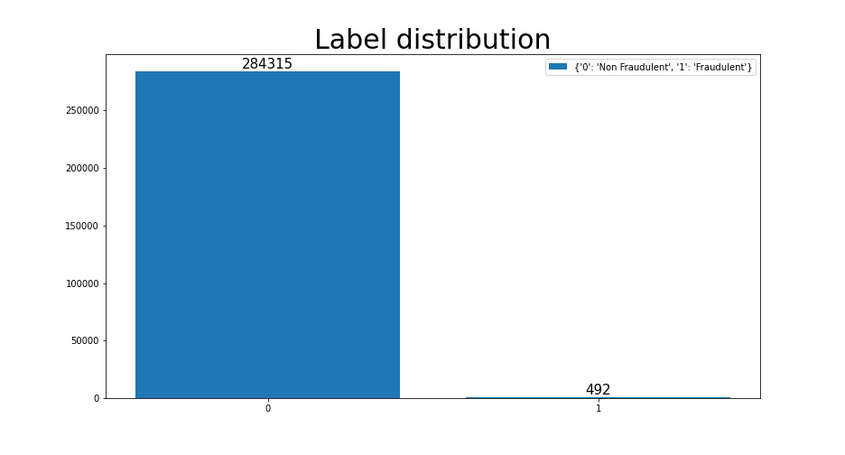

### Fraud over time
For this dataset, it seems like there are no apparent trend in the number of fraud cases and fraud amount over time
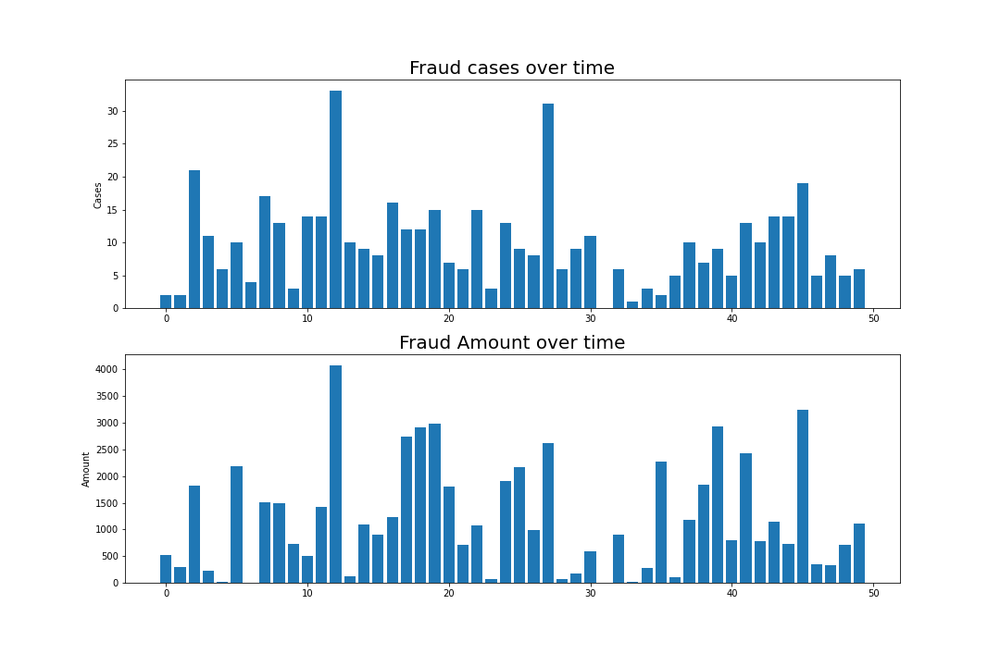


### Correlation plot
In order to see the correlation between the features as well as the target, we can use the correlation plot. The purpose of this exercise is to see if there are highly correlated features that can be removed or features that are have high correlation to the target so we can future enrich these features
#### correlation plot


#### correlation heatmap
Surprising, alot of the features are correlated to time and amount
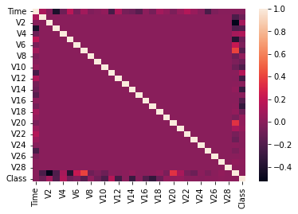

#### correlated features
2 pairs of features are found to be highly correlated but since the features are anonymized, it can be hard to verify the correlation
##### Feature V6 and V5
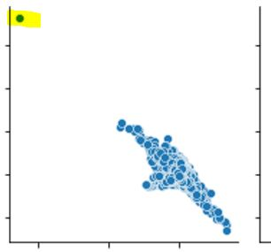

##### Feature V10 and V9


#### Outliers
We are able to identify some outliers from the scatter plots
##### Sample outlier
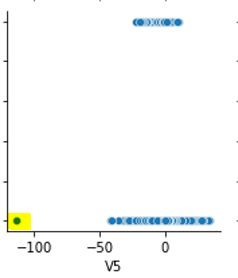


## Dimensionality reduction and visualization
As part of the EDA, I wanted to investigate if there are any clusters. 
### PCA
It seems like there are some cluster in the top left corner of the scatter plot but there are no obvious trend
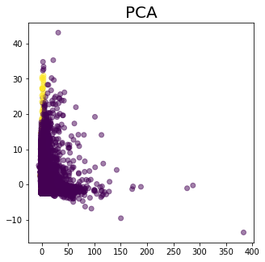

### UMAP
For UMAP, it seems like there are no noticeable clusters. Another important observation that was made is the UMAP took a very long time to run <br>

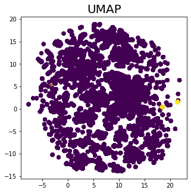

### Improvements
I could have down sample the majority class to count that is similar to the number of fraud cases so clusters are that are form may be more apparent.

## Golden test set creation
Before any further processing, the golden test set is first taken out so we can compare the performance of different models<br>
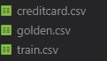<br>
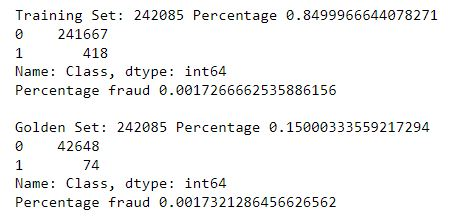


## Model training
The model training was done using Non Neutral-network approach as well as Neutral-network approach

### Important Lightgbm tuning parameters
1. num_leaves 
2. max_depth
3. learning_rate
4. n_estimators
5. min_split_gain
6. reg_alpha(L1)/reg_lambda(L2)
### Sklearn/Lightgbm
- Configurable trainer using yaml.
- GridSearch and CrossValidation
- Saving of best model based on cross validation score
- Using of Sklearn pipeline to group Normalization(Robust Scaler) with model
- experiment tracking using Weights and bias
#### Results
The below image shows the average cross validation score for each type of model
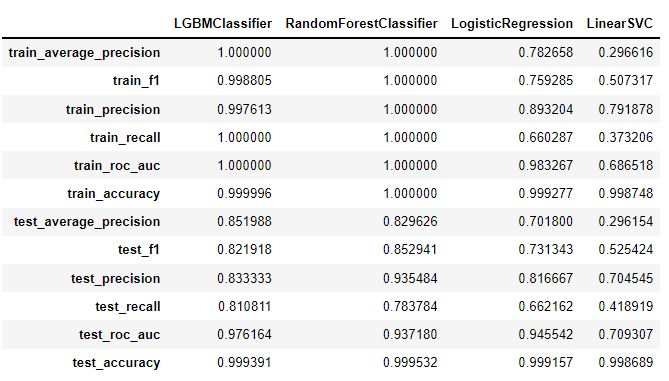

#### Experiment Tracking
All the experiments are tracked using weights and bias so we can review the experiments later
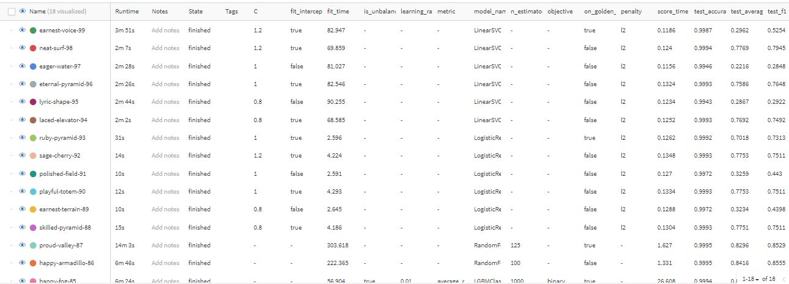

### Deep learning
The deep learning model is trained on COLAB to take advantage of the GPU 
https://colab.research.google.com/drive/1f2ITJBrrAdgBOlJllKsWzYsBXjeDLbvP?usp=sharing

- logging using tensorboard
- FP 16 training uing grad scaler
- 5 fold cross validation

#### Results
The below image shows the training result and the use of tensorboard<br>
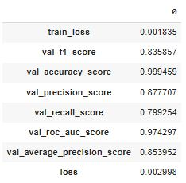
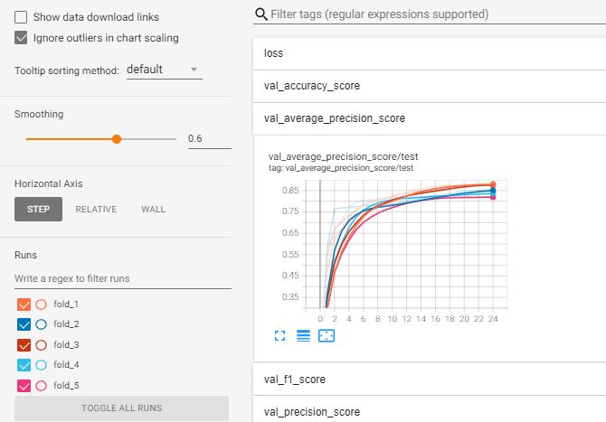

### LightGBM vs Deep learning PR curve
The below image shows the PR curve comparison between deep learning and Lightgbm
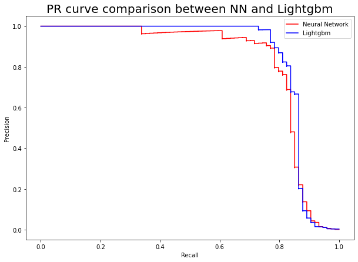

## Exporting to onnx
```python
model = FraudModel(args.n_features)
    model.load_state_dict(torch.load(args.model_weights, map_location=args.map_location))
    model.eval()

    x = torch.randn(1, args.n_features, requires_grad=True)
    x_numpy = x.detach().numpy()

    torch_output = model(x).detach().cpu().numpy()

    torch.onnx.export(model, x, args.output_fp, 
                      export_params=True, opset_version=10, 
                      do_constant_folding=True, input_names=['input'],
                      output_names=['output'],
                      dynamic_axes={'input':{0 :'batchsize'}, 
                                    'output':{0: 'batchsize'}})

    # checking if the export is successful
    onnx_model = onnx.load(args.output_fp)
    onnx.checker.check_model(onnx_model)

    ort_session = onnxruntime.InferenceSession(args.output_fp)
    ort_inputs = {ort_session.get_inputs()[0].name: x_numpy}
    ort_outputs = ort_session.run(None, ort_inputs)

    np.testing.assert_allclose(torch_output, ort_outputs[0], rtol=1e-03, atol=1e-05)
    print("Exported model has been tested with ONNXRuntime, and the result looks good!")
```

### Improvements
Research and practice on how to convert tensorflow/pytorch model into tensorRT format<br>
TensorRT 8.2 contains new module Torch-TensorRT, TensorFlow-TensorRT for direct conversion however, operator avaliablity still remains a challenge<br>
source: https://developer.nvidia.com/blog/nvidia-announces-tensorrt-8-2-and-integrations-with-pytorch-and-tensorflow/


## Explainability using SHAP
As the prediction from fraud detection model will go to a case management team. It is important that we have some kind of explainability for the model prediction to gain some trust from the reviewers. Therefore, in this project, showcasing some explainability using SHAP

### Fraud sample
We can see from below image that feature 14 is the main reason for the fraud prediction
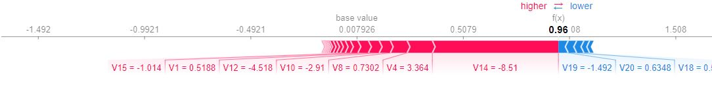

### Non-Fraud sample
We can see from below image that feature 14 is also the main reason for that sample not being a fraud case
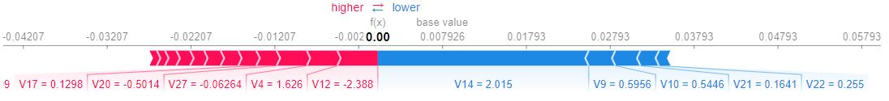

## IMPROVEMENTS
There are many improvements that can be done in this project
1. Testing Downsampling and Upsampling of majority or minority class
2. Feature enrichment using polynomial features and feature crosses
3. Incorporating GNN features (user embeddings)
4. Perform better clustering and create different models for different clusters (eg new users/long time users)
5. Converting GridSearch to automatic tuning like optuna (Completed)


## Sample system design
The below shows a simple fraud detection system design. As I am still learning about machine learning system. The below diagram will many improvements.\
For scaling of the serving servers on GPU. We can use Triton (dynamic batching) on MIG(A100), kubernetes, ngix plus load balancer\
https://developer.nvidia.com/blog/deploying-nvidia-triton-at-scale-with-mig-and-kubernetes/

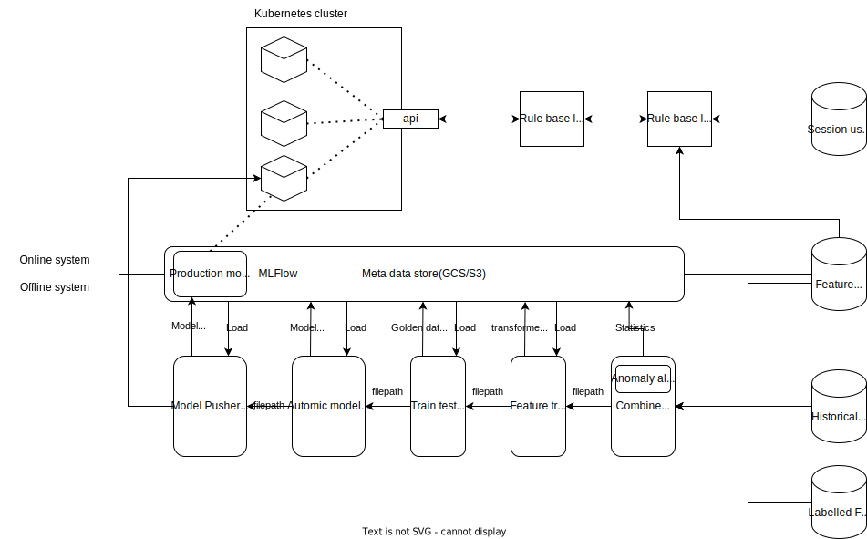

## Book Summary
### BOOK 1 Practical Fraud prevention Fraud and AML Analyitic for Fintech and ecommerce

#### Chapter 1 Fraudster Traits
- End of the day, we dont care about "what" but "who" are the fraudster
- Think from the point of view of the fraudster and the victim

##### Types of fraud/abuse for ecommerce
1. Fraudster can "hack" into existing account and use the account to make unauthorized purchase
2. Fraudster can create new account to perform the fraudulent act
3. Fraudster can use their own account for the fraudulent act
4. Promo abuse / return policy abuse
5. Fake reviews (reduce customer trust)
6. Click Farms/Fraud (Causes ranking to go up)
7. Money laundering (Seller and buyer are the same person)
8. Fraud merchants
9. merchant collusions

##### Types of fraud/abuse for Fintechs/Banks
1. Money laundering (AML)
2. Fake identity during account creation (KYC)

- Shipping address is difficult to impersonate but with the option of collection point option, this will open up some fraud vulnerabilities.
- In Countries like USA and canada, they have Address verification service(AVS) to match the shipping and the billing address but they only match the numbers. In Singapore, we try to match the shipping and billing address.
- Fraudsters or fraud rings typically produce the same type of fraud over and over again until they are interupted
- The number of fraud will increase in different type of the year (like festive season and campaign periods)
- Create multiple models for different situation (non festive season model , campaign model, festive season model)


#### Chapter 2 Type of Fraudsters
1. Amateur Fraudster
    - Can have advantage of local knowledge
    - Simple rules is usually enough to catch this group of fraudsters 
2. Cookie-Cutter Fraudster
    - Brute force attackers using scripts
    - Detect them from the speed of attack
3. Gig economy fraudster
    - usually used as mules
4. Psychological Fraudster
    - Scams elderly or young naive people or romatic scam
    - The same pattern are usually repeated
5. Product Savvy Fraudster
    - abuses return and refund policies.
    - coupon abuses, refund scams, stolen loyalty point 
6. Tech Savvy Fraudster
    - Bot generator
    - Hackers
7. Organized Crime Fraudster
8. Friendly Fraudster
    - uses own account and card and submit chargeback
    - buyer's remorse

#### Chapter 3 Fundamental of Fraud Analysis
- Think like a fraudster
- Account vs transaction fraud
- Need a balance between customer satisfaction and fraud blocking
- Number of frauds go up when the economy is bad or during campaigns


#### Chapter 4 Fraud prevention System
- Rules engines
- Machine Learning (downside its like a black box)
- Data Enrichment tools
- Declined list (lagged data)
- Identity verification
- Story based approach (narrow domain like buying using hotel/airport wifi etc)

##### Third party services
- outseer
- SEON Fraud Prevention
- identiq (providerless)

##### Measuring loss and impact
1. Chargeback rate (Cost of fraud is about 3 times the fraud amount due to logistical efforts etc)
2. Chargeback dispute rate
3. Number of unique address for each coupons (account creation abuse)
4. False Positives (affects customer satisfaction)
5. True Positives (Blocked transaction - False Positives)
6. Fraud rate (True Positive/Total Transaction) in count and dollar cost
7. Block rate (Blocked transaction/Total Transaction) in count and dollar cost
8. Manual review rate

#### Machine Learning and Fraud modeling
1. Train machine learning model that focuses on holiday/flash sale time frame
2. Mix unsupervised and supervised learning models
3. Explainability, ethics and bias
4. For new markets, the company might be more toleratable for fraud to keep a high user satistfaction

#### Fraud labelling
1. Fraud analyst often have to do some clever cherry-picking on fraud case that is likely to repeat itself in the future


### Ecommerce Fraud
1. Stolen card fraud
2. Address manipulation and mules
3. BORIS and BOPIS Fraud
4. Digital Goods and cryptocurrency fraud
5. First party fraud (friendly fraud)


#### Stolen card fraud
- Fraudster gain access to name, card number, expiry and cvv
- Credit card information + matching VPN + matching aged and spoofed email is often sold on the dark web
- Fraudster will use a clean device that has no cookies
- They will set their device to match the profile of the cardholder
- IP and geo location masking
- Query multiple IP geo service provider to cross check
##### How to stop it
- Mismatched IP (too crude to be use alone due to accuracies)
- Repeat offender IP (many people might share the same ip and some ISP recycles ip address)
- Nonunique IP
- Masked IP (not all VPN are frauds)
- GeoIP (GeoIP2 Databases)

#### Address Manipulation
- The fraudster will be trying to pretend to be the real person or someone the real person know
- Porch piracy (Fraudster use their own phone number so they are updated on the delivery or call couriers to change address)
- Send item to public address (barber shops)  or reshipper 
- mule address
- Fake drop shipper (take inorder from his own customer and use stolen credit card to buy)

##### How to stop it
- AVS (us and canada)
- match billing address and shipping address
- ban reshippers

#### Buy Online, Pick up in Store and Buy Online, return In store program
- This method help the fraudster by pass the address issue
- Fraudster are also using mules for returns to monetize the product
- Not very common (maybe the fraudster are afraid to be captured by cctv)

##### How to stop it
- returns will be credited to original account
- identity verification at collection


#### Refund Fraud (friendly fraud)
- Friendly fraud is very different from the other types of fraud as the fraudster use their own identity.
- submit a chargeback
- claims that item was not received
- some are genuine mistake (bank statement company name different from the online name)
- family fraud
- Buyer's remorse
- Customer resentment
##### How to stop it
- proof of delivery
- identify serial offenders

## Features for fraud detection
1. is_billing_shipping_address_match
2. browser_used (chrome, opera, explorer, Tor)
3. browser_language
4. browser_user_agent
4. is_device_id_match_to_historical_record # mobile app
5. client_ip_information (proxies, vpn, maskings)
6. email_address_pattern (numbers only, need to take into account different country culture)
7. number_of_reviews_written
8. number_clicks(excessive clicks for click fraud)
9. click_rates
10. any_entries that look like sql (sql injection)
11. Time_of_purchase (people seldom buy thing at 3.15am)
12. Time since last transaction
13. purchased_item_sale_volume (fraudster want to hide themselves)
14. age_of_account (some aged account are create and sold together with credit card information)
15. current_session_ip_against_previous_session_ip
16. IP_geolocation (is_hotel, is_university, is_military_base, anonymous_proxy)
17. os_used

### BOOK 2 Fraud analytics using descriptive, predictive and social network techniques


